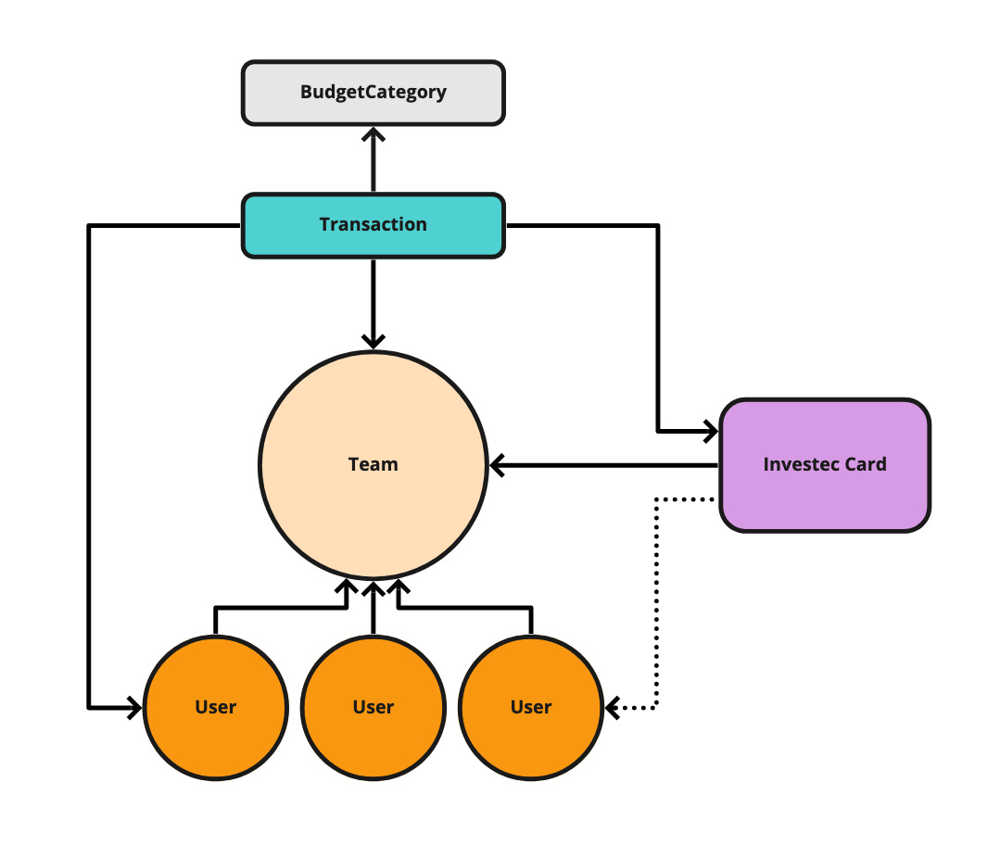

# ROZ

[](https://travis-ci.com/Offerzen/roz) 
[](https://codecov.io/gh/Offerzen/roz)

Financial recon for OfferZen using Investec's Open API.

*Features:*

- Google authentication
- Basic CRUD for users, cards, teams
- Transactions list with categorisation
  - Requires Admin access and can override previous categorisations
- Unauthenticated categorisation per transaction
  - Slack message to alert team of new transactions, and anyone can categorise the transaction and associate it to a user
- Transactions can be exported as CSV for Sage or our internal Cash Report spreadsheet

## Installation

```bash
$ bundle install
$ rails db:setup
```

Create a `.env` file with these keys:

```
SLACK_TEST_NOTIFICATIONS=""
INVESTEC_API_URL=""
INVESTEC_API_USERNAME=""
INVESTEC_API_PASSWORD=""
INVESTEC_API_ACCOUNT_ID=""
SLACK_APP_TOKEN=""
GOOGLE_CLIENT_ID=""
GOOGLE_CLIENT_SECRET=""
DOMAIN="localhost"
PORT="3000"
PROTOCOL="http"
BUGSNAG_API_KEY=""
```

Create a testing env (`.env.testing`) with the following content:

```
SLACK_TEST_NOTIFICATIONS=""
```

You will need to register for Open API access to get your keys. Follow the steps in [Enrolment in the documentation](https://developer.investec.com/programmable-banking/#enrolment).

You will also need to setup Google authentication from the Google Console. [Follow these steps](https://developers.google.com/identity/protocols/oauth2)

## Simple system diagram



- Cards belong to a team, and may also belong to a user
- Transactions belong to a card and a team, and can be assigned to a user or another team
- Transactions belong to a BudgetCategory
- Some BudgetCategories have a special flag and are only for the FinOps team

## Gem wrapper

This project uses the [Investec Open Api gem](https://rubygems.org/gems/investec_open_api). 

# Transaction syncing

Transactions are synced in the [SyncTransactionsJob](app/jobs/sync_transactions_job.rb) and this is run automatically every 30 minutes via Sidekiq.

There is no ID defined by the Open API, and so one is constructed by using `transaction_date` (`date` field), the `description` and `amount` (with sign). Recent transactions are pulled, but these may include existing transactions that have already synced with the app. Transaction IDs that match are ignored.

This still may have clashes since the date field does not include a timestamp. Duplicate transactions are not handled by the app. 

# Slack notifications

Each team has a dedicated Slack channel.

When a new transaction is synced, a notification is sent to the assigned team's Slack channel via the [TransactionNotifier](app/services/transaction_notifier.rb). 

If a transaction belongs to a user's card, that person's name is part of the Slack message, and the message is still sent to the team channel.

# Autocategorization

When transactions are synced, similar transactions are checked. If any transaction exists with the exact same description and card, and the budget category is "Subscriptions" then the new transaction is automatically categorised to the "Subscriptions" budget category. 

No notification is sent for transactions if they are automatically categorised.

## License

This app is available as open source under the terms of the [MIT License](https://opensource.org/licenses/MIT).
